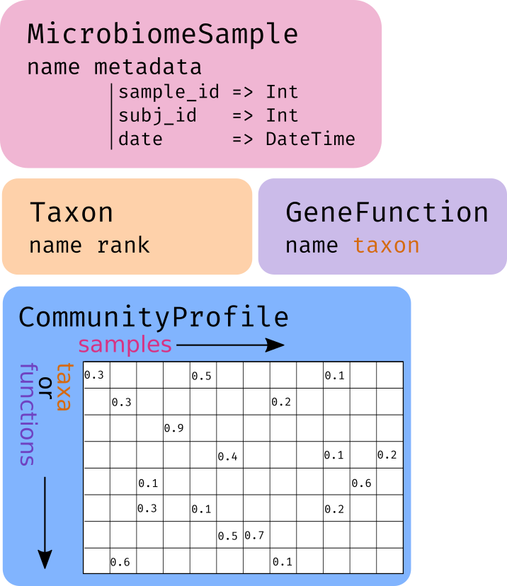
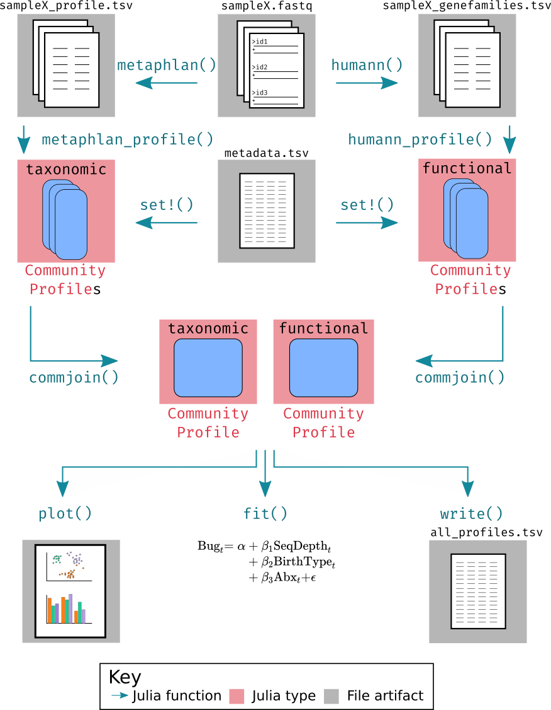

# Summary

`Microbiome.jl` is a julia package to facilitate analysis of microbial community data.
`BiobakeryUtils.jl` is built on top of `Microbiome.jl`,
and provides utilities for working with a suite of command line tools
(the bioBakery) that are widely used for converting raw metagenomic sequencing data
into tables of taxon and gene function counts.
Together, these packages provide an effective way to link microbial community data
with the power of julia's numerical, statistical, and plotting libraries.

# Statement of need

Complex microbial communities exist everywhere, including in and on the human body,
and have profound effects on the environment and human health [@LloydPrice2017].
Common methods for analyzing microbial communities (eg 16S amplicon or metagenomic sequencing)
generate a large quantity of numerical data (eg count or relative abundance data)
as well as metadata associated with biological samples (eg locations, human subject data)
and microbial features (eg taxa, gene functions) [@Mallick2017ExperimentalDA].

The julia programming language [@Bezanson2017-ud] is gaining increasing prominence in biological research
due to its speed and flexibility [@roesch2021julia],
and has a growing ecosystem of packages for working with biological and ecological data,
as well as libraries for Bayesian statistical analysis [@ge2018t],
scientific machine learning [@rackauckas2017differentialequations],
and plotting [@DanischKrumbiegel2021].
Julia's type system makes it incredibly easy for packages to interoperate,
making `Microbiome.jl` and `BiobakeryUtils.jl` an effective bridge between
microbial community data and julia's package ecosystem,
while remaining agnostic to downstream analysis.

# Functionality

At its most basic, microbial community data can be represented as a sparse matrix,
where one dimension is indexed by microbial `feature`s (eg, species),
and the other is indexed by biological `sample`s or observations (eg, a stool sample).
Together, the measured abundances of each `feature` in each `sample`
make up the taxonomic or function "profile."
Typically, additional information (`metadata`) about each `sample`
is also needed for downstream statistical analysis,
such as the location or human subject it was collected from,
data about that environment (salinity, temperature etc for environmental samples,
clinical covariates for human subjects),
and storage or processing details.
While the observed values for microbial `feature`s are uniformly numeric,
and can be efficiently stored in a spares matrix of floating point numbers,
`metadata` can take many forms.
Further, `CommuinityProfile`s may have hundreds to hundreds of thousands of features,
while typically only a few dozen metadata variables are necessary for a given analysis.

`Microbiome.jl` provides a convenient set of types and type constructors
to store and access this information (Figure \autoref{fig1}).

- The `MicrobiomeSample` type contains `name` and `metadata` fields,
  and methods for efficiently adding and extracting stored metadata
- The `Taxon` type stores `name` and taxonomic `rank` (eg `genus`, `phylum`) fields
- The `GeneFunction` type stores `name` and `taxon` fields,
  the later of which may be a `Taxon` (allowing taxonomically stratified gene functions).
- The `CommunityProfile` type, which is a wrapped `SparseMatrixCSC`,
  with `MicrobiomeSample`s as columns and features (`Taxon`s or `GeneFunction`s) as rows.
- `CommunityProfile`s can be indexed like normal julia arrays with integers,
  or with strings and regular expressions that will search on the `name`
  fields of the sample or feature dimensions.

Further, the `CommunityProfile` type implements the `Tables.jl` interface,
making it trivial to convert to other tabular representations,
in particular enabling round-tripping to and from column separated values (`.csv`) files
using `CSV.jl`.
Feature types (`Taxon` and `GeneFunction`), `MicrobiomeSample`, and `CommunityProfile`
types are also implemented with the interface of `EcoBase.jl`,
potentially enabling integration with the wider EcoJulia family of packages.

`BiobakeryUtils.jl` provides a julia interface for the command line utilities
from HUMAnN and MetaPhlAn, two widely-used tools
for using metagenomic sequencing reads to generate
functional and taxonomic profiles respectively.
It also provides functionality to simplify installation of the tools
and I/O for the common file types used and produced by those tools.
Together, `Microbiome.jl` and `BiobakeryUtils.jl`
make it easy to load, manipulate, and analyze microbial community data (Figure \autoref{fig2}).

# Limitations and future work

While `Microbiome.jl` and `BiobakeryUtils.jl` are already functional
and being used for research [@Tso2021-vv; @Lewis2021-be; @Peterson2021-mr],
there are several avenues for further development.
First, there are many additional tools in the bioBakery
whose interface and outputs could be incorporated into `BiobakeryUtils.jl`.
In particular, `StrainPhlAn` and `PanPhlAn` [@Beghini2021-xy],
which have tabular output distinct from, but quite similar to that
of `HUMAnN` and `MetaPhlAn` could be supported.

Second, two of the largest plotting packages in the julia ecosystem,
`Plots.jl` and `Makie.jl` [@tom_breloff_2021_5566503; @DanischKrumbiegel2021]
share a common "recipes" system,
enabling package authors to include instructions to provide instructions
for how to plot their types.
`Microbiome.jl` currently contains convenience functions to facilitate
the generation of easy-to-plot data structures,
but including plot recipes for thing like ordinations (PCoA),
abundance bar plots, and other commonly used microbial community visualizations
would make it even easier to generate publication-quality figures.

Finally, better integration with EcoJulia would carry a host of benefits.
For example, `Diversity.jl` [@Diversity.jl-2016] provides a wide array
of alpha and beta diversity metrics that could be beneficial
for investigations of microbial diversity.
There are also several packages that provide functionality
around phylogenies and taxonomic information
that could enhance or replace `Taxon`,
making it easier to gain insight into the relationships
between different microbial taxa found in communities.

# Acknowledgements

The authors would like to thank the families participating in the RESONANCE cohort.
This work was funded in part by the NIH UG3 OD023313 (VK-C).

# References